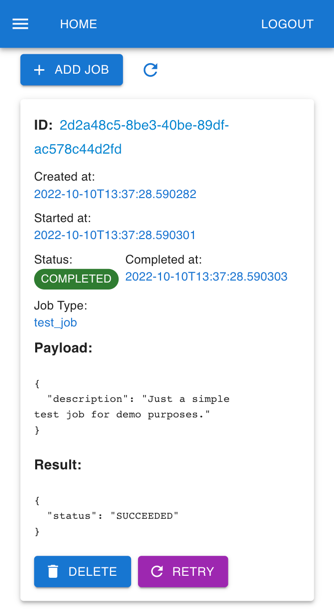

# Demo
Go to https://www.billy.adolha.com and login with:
username: demo@billy.com
password: demo@123456
## Achitecture diagrams

  
UI Screenshots (Mobile)

  
### Sidebar

### Home

### Dashboard

### Bank Statements

### Categories

### Jobs

# Billy
Ever wondered where your $ goes? Nowaday there are many apps and tools that give an overview
of expenses and bills, but they are not personalized and it's difficult to answer questions like:
* How much do you spend on food, rent, gas, travel? 
* How much do you spend on averge on recurrent expenses on a monthly basis?
* What's the expenses trend in the last year(s)?
* Did my providers increase their price? What's the trend in the last year(s)?

Billy is on a mission to answer these questions by collecting data from different providers and analyzing it
to offer insights.

## Providers

Data can be collected from different providers which allow collection via mail, web scraping or other APIs if they have.
Example provider:
* Card statements (e.g. scraping BT card statements sent via mail).
* Gas and electricity bills (scraping my-eon site)
* Internet bills (scraping rcs rds site)
* Phone bills (scraping orange site)

## Architecture

  
